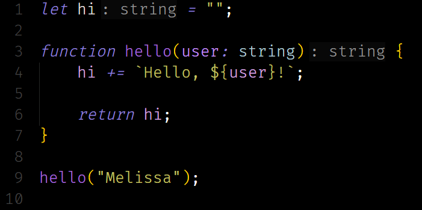

<h1 style="text-align: center; font-size: 33px;">
    Simple Dark
</h1>

    Welcome to the ultimate darkness of the cave. Imagine a cavern mysteriously writing code in a dark, long cave in the middle of nowhere.

    This Visual Studio Code theme features an insanely dark color, while still featuring vibrant colors of many other elements. Perfect for those who are coding at 4 AM and need to finish their project before the 8 AM meeting; this theme will save your eyes, possibly if you are sleep deprived, but don't quote me on that.

<!-- ## Working with Markdown

You can author your README using Visual Studio Code. Here are some useful editor keyboard shortcuts:

* Split the editor (`Cmd+\` on macOS or `Ctrl+\` on Windows and Linux).
* Toggle preview (`Shift+Cmd+V` on macOS or `Shift+Ctrl+V` on Windows and Linux).
* Press `Ctrl+Space` (Windows, Linux, macOS) to see a list of Markdown snippets.

## For more information

* [Visual Studio Code's Markdown Support](http://code.visualstudio.com/docs/languages/markdown)
* [Markdown Syntax Reference](https://help.github.com/articles/markdown-basics/)

**Enjoy!** -->
